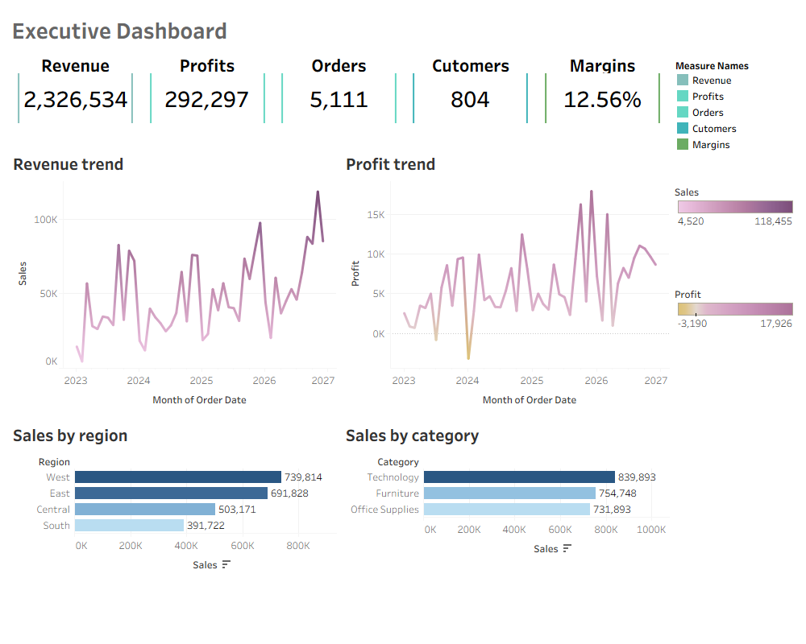
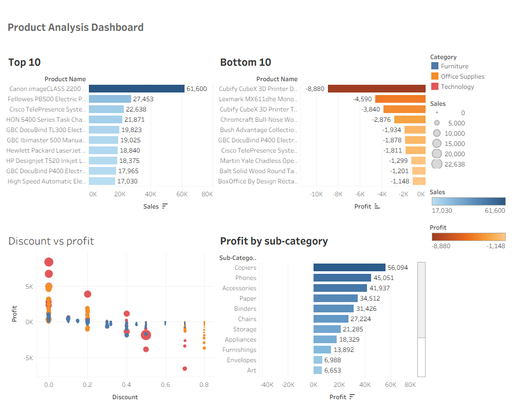
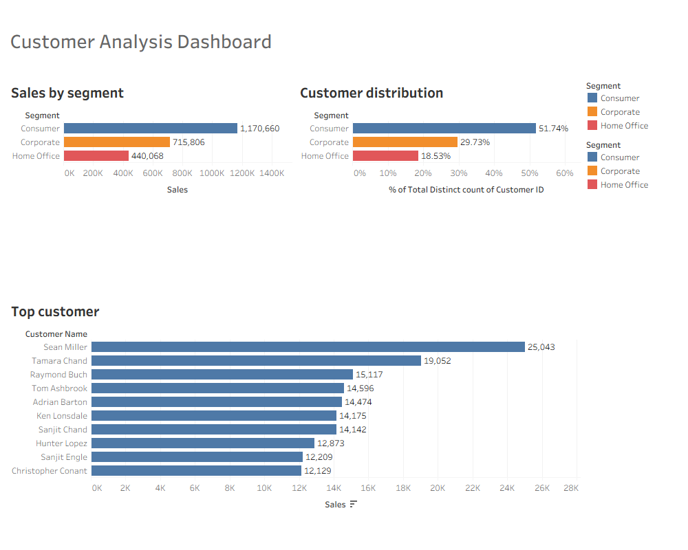
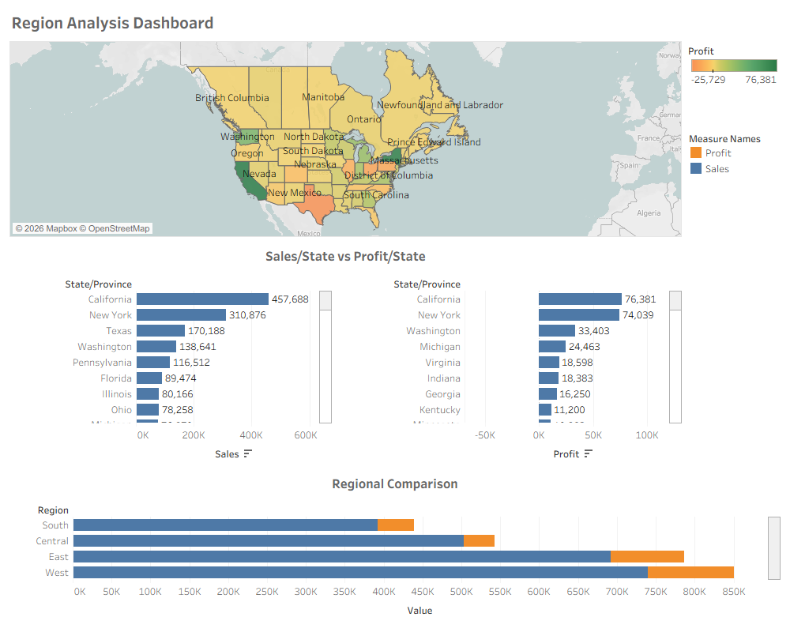

# Superstore Sales Analysis

##  Project Overview

This project analyzes the Superstore sales dataset to identify business performance, customer behavior, product profitability, and regional sales trends.

The analysis combines SQL for data exploration and Tableau for dashboard visualization. The goal is to transform raw transactional data into actionable business insights and strategic recommendations that support better business decisions.


## Business Problem

The company wants to understand:

- How is the overall sales performance?
- Which products generate the highest and lowest profits?
- Which customer segments contribute the most revenue?
- Which regions perform best?
- How do discounts impact profitability?
- What strategic actions should be taken to improve business performance?

##  Project Goal

The objective of this project is to demonstrate an end-to-end data analysis workflow by transforming raw transactional data into actionable business insights.

This portfolio project showcases practical skills in:

- SQL for data exploration
- Business analysis
- Tableau dashboard development
- Insight generation
- Strategic business recommendations

The project is intended to reflect the responsibilities of a Data Analyst in a real business environment.

##  Dataset

**Dataset:** Sample Superstore Dataset

Dataset contains:

- Orders
- Customers
- Products
- Sales
- Profit
- Discount
- Shipping Information
- Region & State

Main Metrics:

- Sales
- Profit
- Profit Margin
- Orders
- Customers


## Tools

| Tool | Purpose |
|------|---------|
| PostgreSQL | Data Storage & SQL Query |
| SQL | Data Exploration |
| Tableau | Dashboard Visualization |
| Git | Version Control |
| GitHub | Project Repository |

---
## Project Structure
```
superstore-sales-analysis/
│
├── dashboard/
│   ├── dashboard_report.twbx
│   ├── executive_dashboard.png
│   ├── product_analysis.png
│   ├── customer_analysis.png
│   └── regional_analysis.png
│
├── dataset/
│   └── superstore.xlsx
│
├── reports/
│   └── business_report.md
│
├── sql/
│   ├── sales_performance.sql
│   ├── product_analysis.sql
│   ├── customer_analysis.sql
│   ├── regional_analysis.sql
│   ├── profitability.sql
│   └── discount_analysis.sql
│
├── load.py
│
└── README.md
```


## SQL Analysis

The SQL scripts are organized by business domain, with each file answering a specific business question. This structure improves readability, maintainability, and makes it easier to trace each analysis back to its corresponding business objective.

| SQL File | Business Question |
|----------|-------------------|
| `sales_performance.sql` | How is the overall sales performance across categories, regions, and over time? |
| `product_analysis.sql` | Which products generate the highest and lowest sales and profit? |
| `customer_analysis.sql` | Which customer segments and customers contribute the most revenue? |
| `regional_analysis.sql` | Which regions and states perform best in terms of sales and profit? |
| `profitability.sql` | Which categories and sub-categories generate the highest profit and profit margin? |
| `discount_analysis.sql` | How do discounts impact sales and profitability? |

### Example Query

```sql
-- Top 10 Products by Sales

SELECT
    product_name,
    SUM(sales) AS total_sales
FROM sales_data
GROUP BY product_name
ORDER BY total_sales DESC
LIMIT 10;
```


## Dashboard

The Tableau dashboard consists of four analytical pages.

### Executive Dashboard

- Revenue
- Profit
- Orders
- Customers
- Profit Margin
- Monthly Sales Trend
- Regional Sales
- Sales by Category

### Product Dashboard

- Top 10 Products
- Bottom 10 Products
- Profit by Sub-Category
- Discount vs Profit

### Customer Dashboard

- Sales by Segment
- Customer Distribution
- Top Customers
- Sales per Customer

### Regional Dashboard

- Sales by State
- Profit by State
- Regional Comparison
- Sales Distribution

---

##  Dashboard Preview

### Executive Dashboard



### Product Dashboard



### Customer Dashboard



### Regional Dashboard



---

## Business Report

The business report summarizes findings, business insights, and strategic recommendations derived from each dashboard. It translates analytical results into actionable recommendations that support business decision-making.


## Key Insights

### 1. Technology Drives Business Performance

Technology generated the highest revenue and profit among all product categories, making it the company's strongest business segment.

### 2. Sales Performance Differs by Region

The West region consistently outperformed other regions, suggesting opportunities to improve sales performance in lower-performing markets.

### 3. High Discounts Reduce Profitability

Products receiving higher discounts generally produced lower profits, indicating that discount strategies should be carefully optimized.

## Final Recommendation

- Improve sales performance in underperforming regions.
- Optimize discount strategies to protect profit margins.
- Increase focus on high-profit product categories.
- Review low-performing products for possible discontinuation.
- Expand customer acquisition in Corporate and Home Office segments.
- Improve inventory planning based on regional demand.


## Conclusion

This project demonstrates an end-to-end Business Intelligence workflow, including SQL data exploration, business analysis, Tableau dashboard development, insight generation, and strategic business recommendations. It showcases both technical and analytical skills expected from a Data Analyst in real-world business scenarios.
